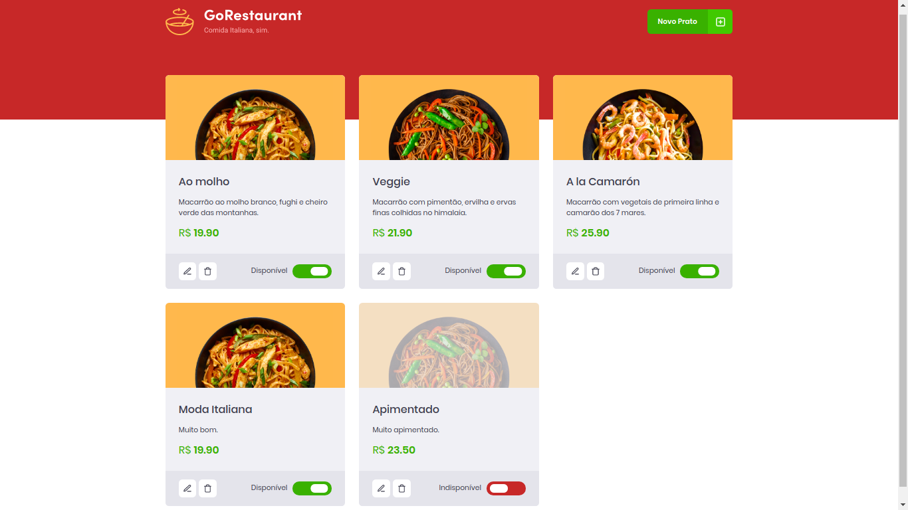
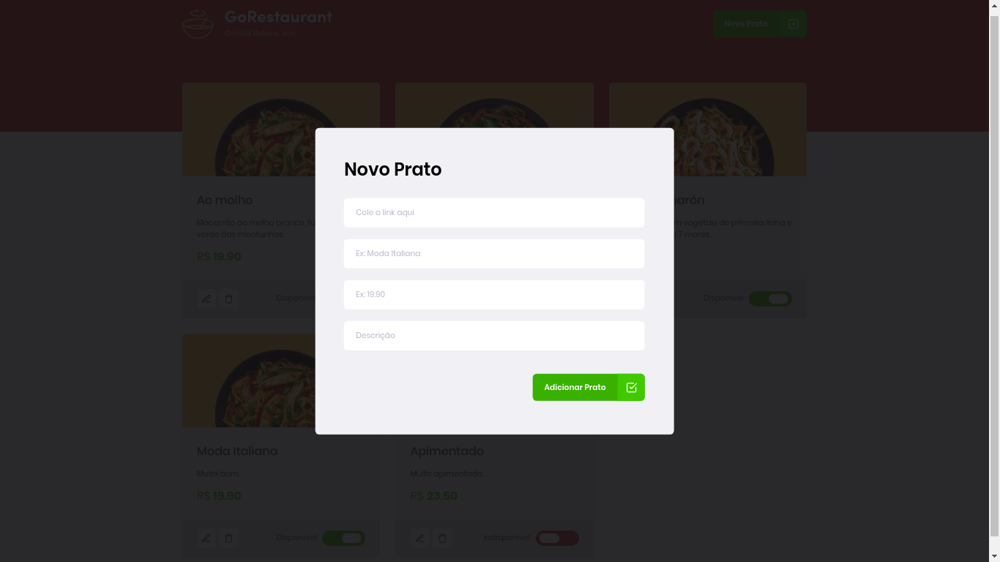
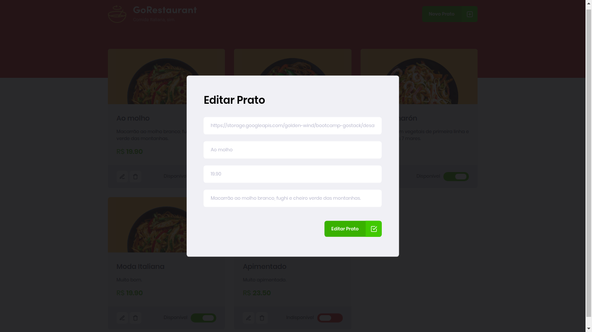

<h1 align="center">
  GoRestaurant
  <hr />
  
  
  
  <hr />
	
</h1>
<p align="center">
	A simple CRUD site made with Typescript and ReactJS to show an modify a restaurant menu.
</p>
<h1>Technologies used in this application:<h2>

### ReactJS (WebClient)
- Axios
- Unform
- Styled Components

### JSON-Server (Fake API)

<h1>Get started</h1>

### !!! Requirements
- Yarn

To start the aplications in your device, first, clone this repository in a new folder. Open the folder and, with your terminal, run ```yarn```. After the dependeces instalation, run ```yarn json-server server.json -p 3333``` to start the fake api server on port 3333. After that, run ```yarn start```.

A new tab will be open in your browser with the application.
