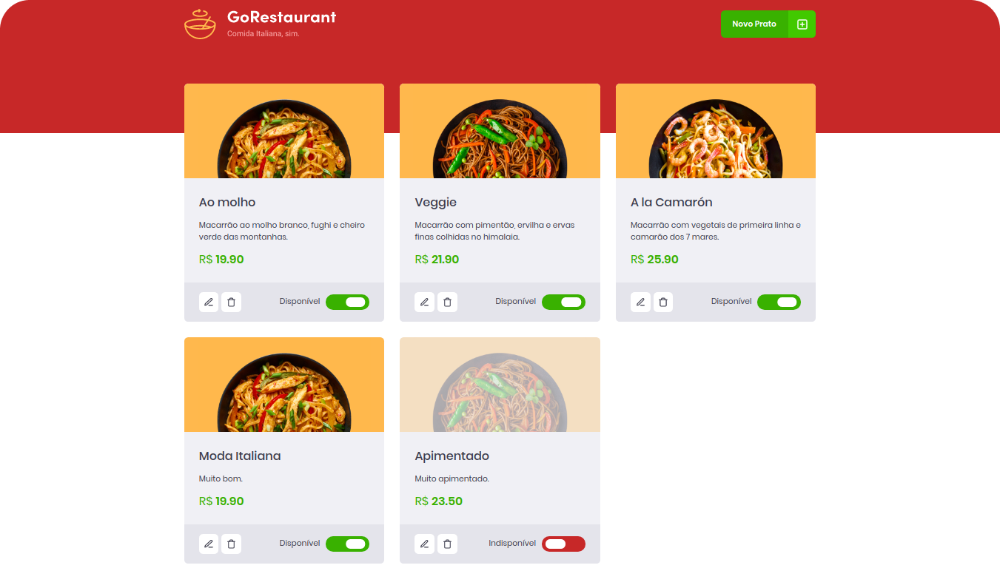
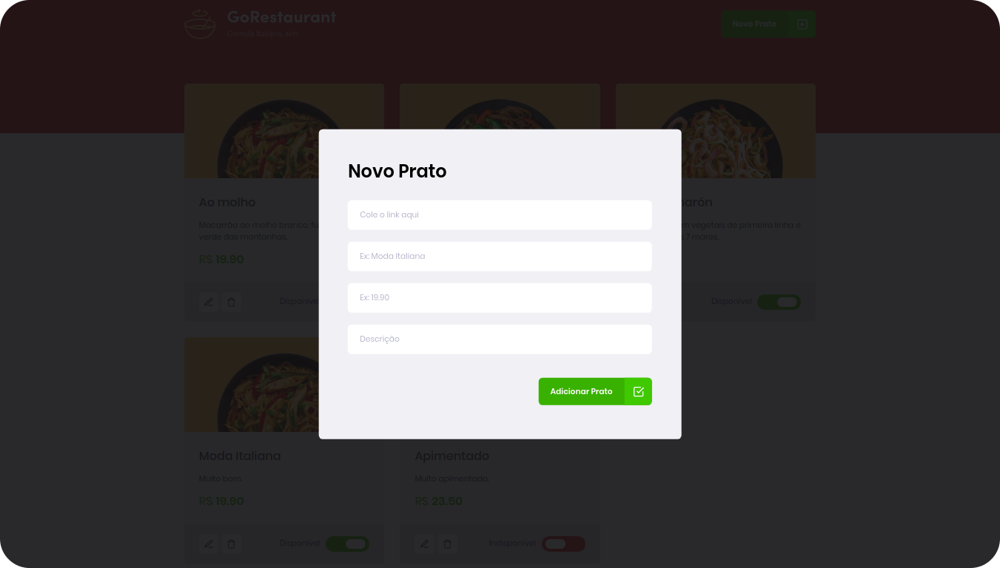
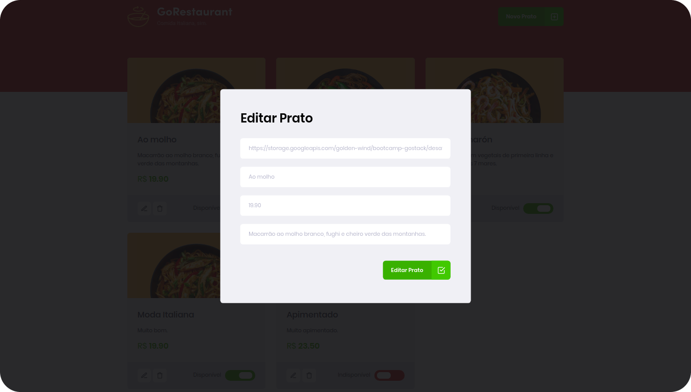

<br />

<p align="center">
  
</p>

<h1 align="center" style="text-align: center;">GoRestaurant</h1>

<p align="center">
	<a href="https://github.com/LuizFerK">
		
	</a>
	<a href="#">
		
	</a>
	<a href="hhttps://github.com/LuizFerK/GoRestaurant/stargazers">
		
	</a>
	<a href="https://github.com/LuizFerK/GoRestaurant/network/members">
		
	</a>
	<a href="https://github.com/LuizFerK/GoRestaurant/graphs/contributors">
		
	</a>
</p>

<p align="center">
	<b>Italian food, yes!</b><br />
  A simple CRUD site to show and modify a restaurant menu.<br />
	<span>Created with ReactJS and React Native, all with Typescript.</span><br />
	<sub>Made with ❤️</sub>
</p>

<br />

<p align="center">
  
  
  
  
  
  
  
  
  
</p>

<br />

# :pushpin: Contents

- [Features](#rocket-features)
- [Installation](#wrench-installation)
- [Getting started](#bulb-getting-started)
- [Techs](#fire-techs)
- [Issues](#bug-issues)
- [License](#book-license)

# :rocket: Features

### Web

- List all the plates of your restaurant
- Create new plates
- Update plates that already exists
- Delete plates
- Turn plates to avaiable or unavailable

### Mobile

- Search plates by category and name
- Create an order with extras and set the quantity
- See your orders
- Favorite plates
- See your favorite plates to order them again!

# :wrench: Installation

### Required :warning:
- Yarn
- Node.js

### SSH

SSH URLs provide access to a Git repository via SSH, a secure protocol. If you have an SSH key registered in your GitHub account, clone the project using this command:

```git clone git@github.com:LuizFerK/GoRestaurant.git```

### HTTPS

In case you don't have an SSH key on your GitHub account, you can clone the project using the HTTPS URL, run this command:

```git clone https://github.com/LuizFerK/GoRestaurant.git```

**Both of this commands will generates a folder called GoRestaurant, with all the project**

# :bulb: Getting started

### Web

1. Open the **web** folder an run ```yarn``` to install the dependencies;
2. This app use a fake api. In the project folder, run ```yarn json-server server.json -p 3333 -H YOUR-IPV4-ADDRESS```;
> Example: ```yarn json-server server.json -p 3333 -H 192.168.1.11```
3. Run ```yarn start``` to open the web application on port 3000. (the app will open in your browser automatically)

### Mobile

1. Open the folder and run ```yarn``` to install the dependencies;
2. This app use a fake api. In the project folder, run ```yarn json-server server.json -p 3333 -H YOUR-IPV4-ADDRESS```;
> Example: ```yarn json-server server.json -p 3333 -H 192.168.1.11```
3. In ```src/services/api.ts``` change the baseURL for your IPv4 address: ```baseURL: 'http://YOUR-IPV4-ADDRESS:3333'```;
> Example: ```baseURL: 'http://192.168.1.11:3333'```
4. Connect your device to your computer and enable the [debugger mode](https://developer.android.com/studio/debug/dev-options) on the developer tools;
5. Run ```yarn android``` to install the app on your **Android** or ```yarn ios``` to run on your **IOS**;
6. Run ```yarn start``` to open the metro-bundler and get access to the server app on mobile. (close the app and open again)

# :fire: Techs

### Typescript (language)

### JSON Server (fake API)

### ReactJS (web)
- Axios
- Styled Components
- React Router DOM
- React Modal

### React Native (mobile)
- Axios
- Styled Components
- @React Navigation | Stack

# :bug: Issues

Find a bug or error on the project? Please, feel free to send me the issue on the [GoRestaurant issues area](https://github.com/LuizFerK/GoRestaurant/issues), with a title and a description of your found!

If you know the origin of the error and know how to resolve it, please, send me a pull request, I will love to review it!

# :book: License

Released in 2020.

This project is under the [MIT license](https://github.com/LuizFerK/GoRestaurant/blob/master/LICENSE).

<p align="center">
	< keep coding /> :rocket: :heart:
</p>